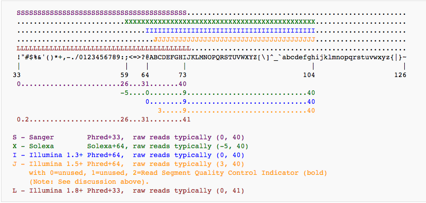
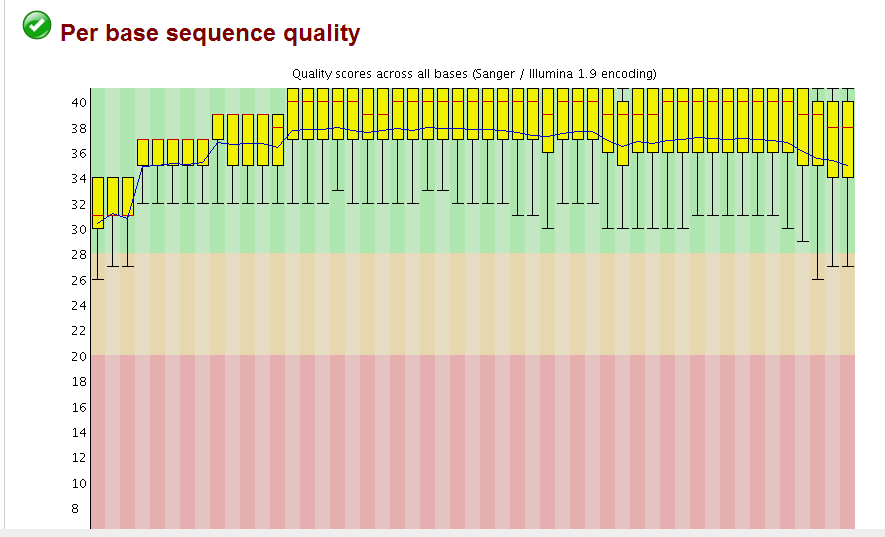
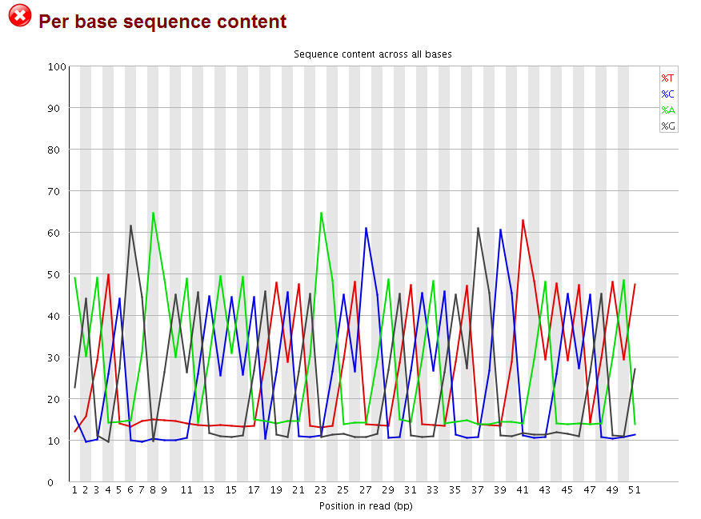
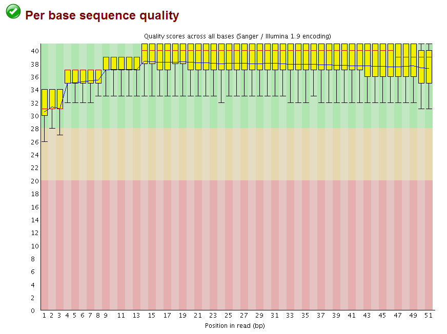
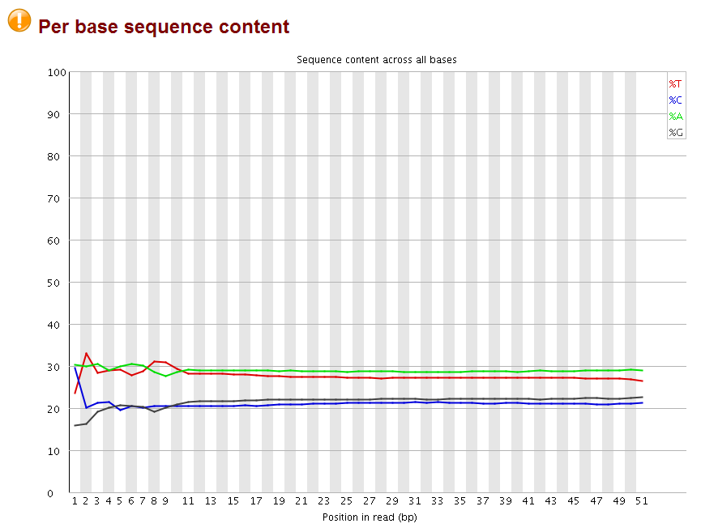
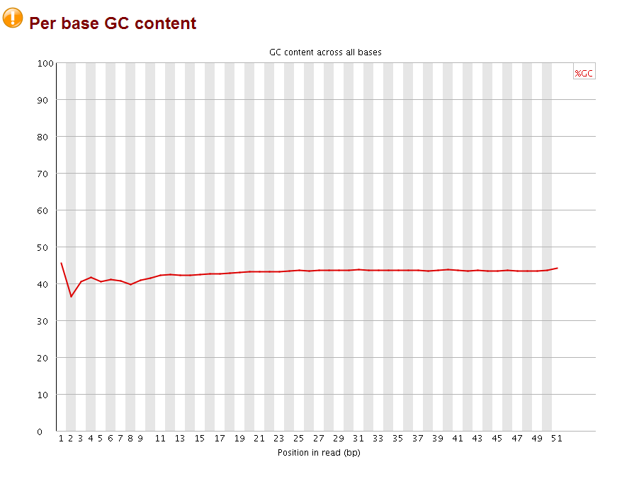
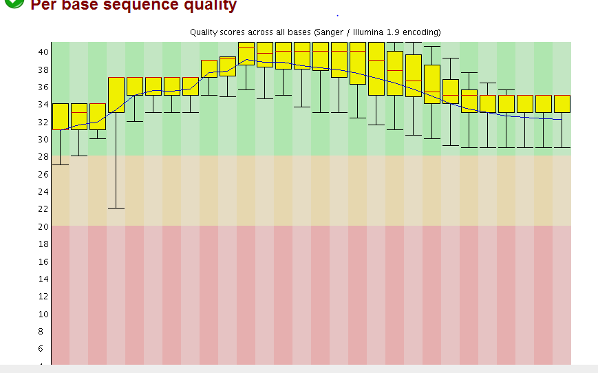
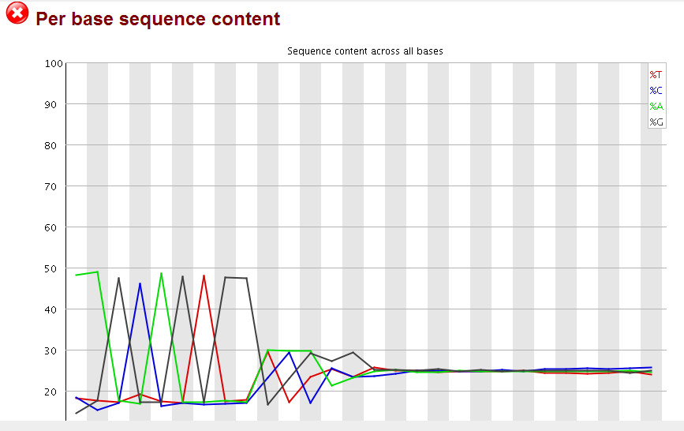
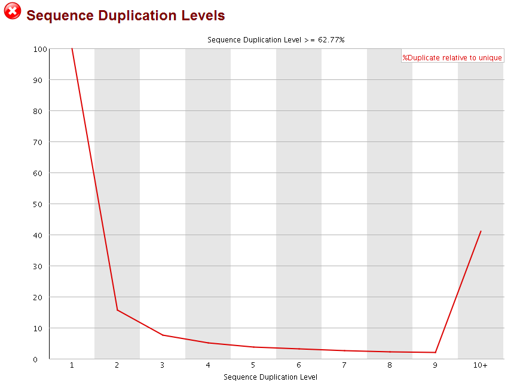
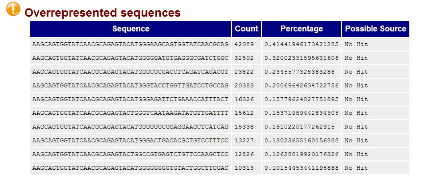

### Quality control with fastqc

For raw sequencing files in fastq format, [fastqc](http://www.bioinformatics.babraham.ac.uk/projects/fastqc/) is used to do quality control.

read my [blog post](http://crazyhottommy.blogspot.com/2014/06/quality-control-of-your-fastq-file-my.html)

Let's start.
inspecting the first several reads of the fastq (this is a ChIP-seq data), I found the quality is coded as [phred33](https://en.wikipedia.org/wiki/Phred_quality_score)

```
@SRR866627_nutlin_p53.1 HWI-ST571:161:D0YP4ACXX:3:1101:1437:2055 length=51
NCGAAAGACTGCTGGCCGACGTCGAGGTCCCGATTGTCGGCGTCGGCGGCA
+SRR866627_nutlin_p53.1 HWI-ST571:161:D0YP4ACXX:3:1101:1437:2055 length=51
#1:AABDDH<?CF<CFHH@D:??FAEE6?FHDAA=@CF@4@EBA88@;575
@SRR866627_nutlin_p53.2 HWI-ST571:161:D0YP4ACXX:3:1101:1423:2163 length=51
GAAATACTGTCTCTACTAAAAATACAAAAAGTAGCCAGGCGTCGTGGTGCA
+SRR866627_nutlin_p53.2 HWI-ST571:161:D0YP4ACXX:3:1101:1423:2163 length=51
B@CFFFFFHHHHGIJJJJIJJJIJJJJIJJIEGHIJJJJIJIIIHIE=FGC
```


To know different quality coding see:  



then I used fastqc to check the quality:





the quality for each base is very good, but the perbase sequence content does not look good, and the adapters are not trimmed as indicated by the overrepresented sequences (highlighted part is part of the Truseq adapter index1).

Then I used [Trimmomatic](http://www.usadellab.org/cms/?page=trimmomatic) to trim the adapters and the low quality bases.
`$ trimmomatic SE  in.fastq in_trimmed.fastq ILLUMINACLIP:Truseq_adaptor.fa:2:30:10 LEADING:3 TRAILING:3 SLIDINGWINDOW:4:15 MINLEN:36`

the Truseq_adaptor.fa file contains the adapter sequences. see a post here.

```
$ cat Truseq_adaptor.fa
>TruSeq_Universal_Adapter
AATGATACGGCGACCACCGAGATCTACACTCTTTCCCTACACGACGCTCTTCCGATCT
>TruSeq_Adapter_Index_1
GATCGGAAGAGCACACGTCTGAACTCCAGTCACATCACGATCTCGTATGCCGTCTTCTGCTTG
>TruSeq_Adapter_Index_2
GATCGGAAGAGCACACGTCTGAACTCCAGTCACCGATGTATCTCGTATGCCGTCTTCTGCTTG
>TruSeq_Adapter_Index_3
GATCGGAAGAGCACACGTCTGAACTCCAGTCACTTAGGCATCTCGTATGCCGTCTTCTGCTTG
>TruSeq_Adapter_Index_4
GATCGGAAGAGCACACGTCTGAACTCCAGTCACTGACCAATCTCGTATGCCGTCTTCTGCTTG
>TruSeq_Adapter_Index_5
GATCGGAAGAGCACACGTCTGAACTCCAGTCACACAGTGATCTCGTATGCCGTCTTCTGCTTG
>TruSeq_Adapter_Index_6
GATCGGAAGAGCACACGTCTGAACTCCAGTCACGCCAATATCTCGTATGCCGTCTTCTGCTTG
>TruSeq_Adapter_Index_7
GATCGGAAGAGCACACGTCTGAACTCCAGTCACCAGATCATCTCGTATGCCGTCTTCTGCTTG
>TruSeq_Adapter_Index_8
GATCGGAAGAGCACACGTCTGAACTCCAGTCACACTTGAATCTCGTATGCCGTCTTCTGCTTG
>TruSeq_Adapter_Index_9
GATCGGAAGAGCACACGTCTGAACTCCAGTCACGATCAGATCTCGTATGCCGTCTTCTGCTTG
>TruSeq_Adapter_Index_10
GATCGGAAGAGCACACGTCTGAACTCCAGTCACTAGCTTATCTCGTATGCCGTCTTCTGCTTG
>TruSeq_Adapter_Index_11
GATCGGAAGAGCACACGTCTGAACTCCAGTCACGGCTACATCTCGTATGCCGTCTTCTGCTTG
>TruSeq_Adapter_Index_12
GATCGGAAGAGCACACGTCTGAACTCCAGTCACCTTGTAATCTCGTATGCCGTCTTCTGCTTG
```
after that, I checked the with fastqc again:




The perbase quality was improved and the per base GC content became more normal (should be 25% percent for each A,T,C,G base, it looks like the sequences are more A/T rich). More importantly, no overrepresent sequences were found anymore. Now the fastq file is ready for subsequent mapping by bowtie.


###RNA-seq reads quality control
sometime ago, I quality controlled a RNA-seq data, and found found many wired things and asked on [biostar](https://www.biostars.org/p/99327/#99451).
fastqc output:







Take home messages:  
1)  
"The weird per-base content is extremely normal and is typically referred to as the "random" hexamer effect, since things aren't actually amplified in a uniform manner. Most people will have this and it's nothing to worry about. BTW, don't let anyone talk you into trimming that off, it's the legitimate sequence."

2)  
"Duplicates are expected in RNAseq. Firstly, your samples are probably full of rRNAs, even if you performed ribodepletion. Secondly, any highly expressed gene is going to have apparent PCR duplication due solely to it being highly expressed (there is a ceiling on the coverage you can get before running into this, it's pretty high with paired-end reads but not infinite)."

3)
Several posts for whether the duplicates need to be removed or not.
https://www.biostars.org/p/55648/
https://www.biostars.org/p/66831/
https://www.biostars.org/p/14283/


### [Tutorial: Revisiting the FastQC read duplication report](https://www.biostars.org/p/107402/)

Quote from Istavan Albert:
>The new plots now contain two different curves and the meaning of the percentage has also changed.  The explanations in the docs are little bit lacking  to make sure I got it right I wrote a python implementation (see the end) that produces the same plots.

>I found it helpful to use the term "distinct" sequences rather than unique sequences as this latter term seems to imply to some that those sequences are present only once in the data. So distinct sequences are defined as the largest subset of sequences where no two sequences are identical.

>Thus distinct sequences = number of singletons (sequences that appear only once) + number of doubles (number of sequences that appear twice but each double will be counted only once) + number of triplets (sequences that appear three times but each will be counted once)  ... and so on.

>The percentage in the title is computed as the distinct/total * 100

>The blue line represents the counts of all the sequences that are duplicated at a given rate. The percentage is computed relative to the total number of reads.

>The red line represents the number of distinct sequences that are duplicated at a given rate. The percentage is computed relative to the total number of distinct sequences in the data.

>Let's take two examples where each contain 20 reads:

>Case 1: 10 unique reads +  5 reads each present twice (duplicates)
Case 2: 10 unique reads + 1 read present 10 times 
Case 1 shown in the upper plot will lead to 15 distinct reads and thus 15/20=75% percent remaining, the number of singletons is 1x10 =10 and the number of doubles is 5x2 =10 therefore the blue line has a plateau at those rates. The 15 distinct sequences are distributed as  10 singletons and 5 duplicates, 10/15=66% and 5/15=33% is the slope of the red line.

>Case 2 will produce 11 distinct reads and therefore 11/20=55% will be the precent remaining reads. Again the total number of reads is equally distributed between the two cases but this time the peak will be at 10 since we have one read duplicated 10 times and that produces 10 sequences. But there are 11 total groups where 10/11=91% are singletons and 1/11=9% of the groups form at duplication rate of 10x.


[Another post](http://proteo.me.uk/2013/09/a-new-way-to-look-at-duplication-in-fastqc-v0-11/) by Andrews Simon, the author of fastqc.
