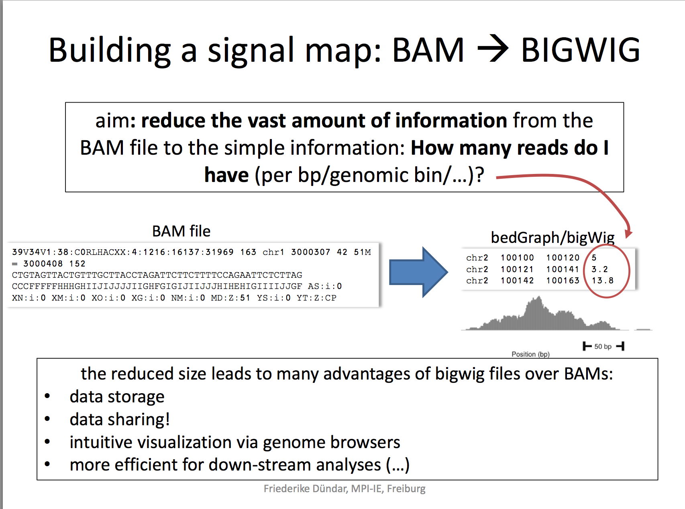
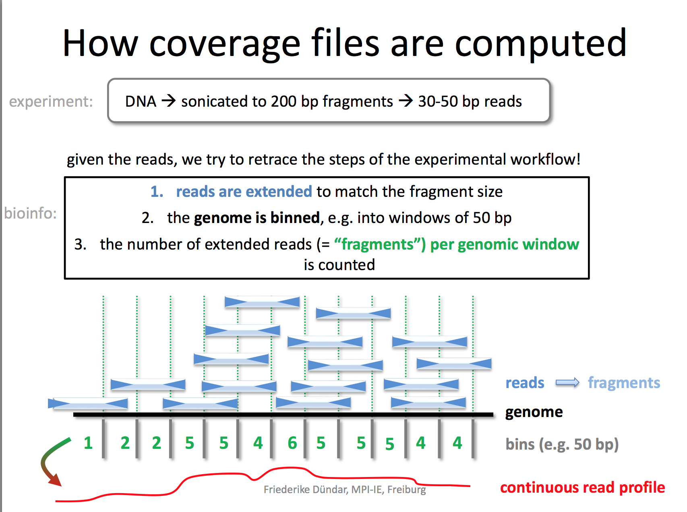
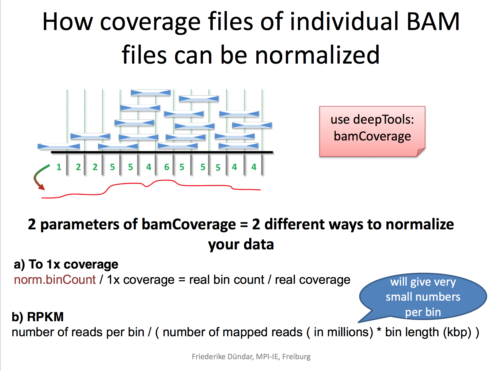

[Bigwig](http://genome.ucsc.edu/goldenpath/help/bigWig.html) is very good for visualization in IGV and UCSC genome browser.There are many tools to convert bam to bigwig. 

Make sure you understand the other two closely related file formats:  
 
* [bedgraph](http://genome.ucsc.edu/goldenpath/help/bedgraph.html):The bedGraph format is an older format used to display sparse data or data that contains elements of varying size.  
* [wig file](http://genome.ucsc.edu/goldenpath/help/wiggle.html): The wiggle (WIG) format is an older format for display of dense, continuous data such as GC percent, probability scores, and transcriptome data. Wiggle data elements must be **equally sized**.

See my old blog posts:  
[My first play with GRO-seq data, from sam to bedgraph for visualization](http://crazyhottommy.blogspot.com/2013/10/my-first-play-with-gro-seq-data-from.html)  
[hosting bigwig by dropbox for UCSC visualization](http://crazyhottommy.blogspot.com/2014/02/hosting-bigwig-by-dropbox-for-ucsc.html)  
[MeDIP-seq and histone modification ChIP-seq analysis](http://crazyhottommy.blogspot.com/2014/01/medip-seq-and-histone-modification-chip.html)  
bedtools genomeCoverage [convert bam file to bigwig file and visualize in UCSC genome browser in a Box (GBiB)](http://crazyhottommy.blogspot.com/2014/10/convert-bam-file-to-bigwig-file-and.html)   

MACS2 outputs bedgraph file as well, but the file is big. In addition, extending the reads to 200bp will exceed the chromosome ends in some cases. If you load the bedgraph to UCSC, you will get an error complaining this. One needs to use bedClip to get around with it.

Install `bedClip` and `bedGraphToBigWig` [UCSC utilities](http://hgdownload.soe.ucsc.edu/admin/exe/linux.x86_64/) first.

### Using bedtools

**Not sure, how to extend the reads to 200bp using bedtools**,
without extending:  

```bash
#! /bin/bash

for bam in *bam
do 
echo $bam 
genomeCoverageBed -ibam $bam -bg -g hg19.genome.info > $(basename $bam .bam).bdg
done
```
Convert bedgraph to bigwig. credits go to [Tao Liu](https://gist.github.com/taoliu/2469050):

```bash
#!/bin/bash

# this script is from Tao Liu https://gist.github.com/taoliu/2469050 
# check commands: slopBed, bedGraphToBigWig and bedClip
 
which bedtools &>/dev/null || { echo "bedtools not found! Download bedTools: <http://code.google.com/p/bedtools/>"; exit 1; }
which bedGraphToBigWig &>/dev/null || { echo "bedGraphToBigWig not found! Download: <http://hgdownload.cse.ucsc.edu/admin/exe/>"; exit 1; }
which bedClip &>/dev/null || { echo "bedClip not found! Download: <http://hgdownload.cse.ucsc.edu/admin/exe/>"; exit 1; }
 
# end of checking
 
if [ $# -lt 2 ];then
    echo "Need 2 parameters! <bedgraph> <chrom info>"
    exit
fi
 
F=$1
G=$2
 
bedtools slop -i ${F} -g ${G} -b 0 | bedClip stdin ${G} ${F}.clip
 
bedGraphToBigWig ${F}.clip ${G} ${F/bdg/bw}
 
rm -f ${F}.clip

```

### Using Deeptools


I personally like to covert the bam files directly to [bigwig](https://genome.ucsc.edu/goldenPath/help/bigWig.html) files using [deeptools](https://github.com/fidelram/deepTools). Using 10bp as a bin size, I get a bigwig file of 205Mb and you can directly load it into IGV.  
`bamCoverage -b ../data/wgEncodeSydhHistonePanc1H3k27acUcdAlnRep1.bam --normalizeTo1x 2451960000 --missingDataAsZero yes --binSize 10 --fragmentLength 200 -o panc1_H3k27acRep1_deeptool_normalized.bw`  

`--fragmentLength 200` will extend the reads at 3' end to 200bp, which is more reasonable for ChIP-seq data. We only sequence the first (36)bp of the DNA fragment pulled down by antibodies.
see [here](https://www.biostars.org/p/49775/#158050)

I really like the demonstration of how coverage files are computed by the `deeptools` [author](https://docs.google.com/file/d/0B8DPnFM4SLr2UjdYNkQ0dElEMm8/edit?usp=sharing):  


**reads will be extended to 200bp before counting**



**which normalization you want to use? RPKM(like RNA-seq) or 1 x Coverage**:
  

RPKM:  
reads per kilobase per million reads  
The formula is: RPKM (per bin) = number of reads per bin /(number of mapped reads (in millions) * bin length (kp))  

RPGC:  
reads per genomic content  
used to normalize reads to 1x depth of coverage  
sequencing depth is defined as: (total number of mapped reads * fragment length) / effective genome size


### Using HTSeq

HTSeq is a python library that is designed for NGS sequencing analysis.
The [`HTSeq-count`](http://www-huber.embl.de/users/anders/HTSeq/doc/count.html) program is widely used for RNA-seq counting.

```python
import HTSeq

alignment_file = HTSeq.SAM_Reader("SRR817000.sam")
# HTSeq also has a BAM_Reader function to handle the bam file

# initialize a Genomic Array (a class defined in the HTSeq package to deal with NGS data,
# it allows transparent access of the data through the GenomicInterval object)
# more reading http://www-huber.embl.de/users/anders/HTSeq/doc/genomic.html#genomic

fragmentsize = 200

coverage = HTSeq.GenomicArray("auto", stranded = True, typecode = 'i')

# go through the alignment file, add count by 1 if in that Interval there is a read mapped there

for alignment in alignment_file:
  if alignment.aligned:
  	# extend to 200bp
  	almnt.iv.length = fragmentsize
    coverage[ alignment.iv] += 1

# it takes a while to construct this coverage array since python goes through every read in the big SAM file

# write the file to bedgraph
coverage.write_bedgraph_file ( "plus.wig", "+")
coverage.write_bedgraph_file ( "minus.wig", "-")

```
We get the wig file (Note, this wig is in 1 base resolution), and then can convert wig to bigwig using UCSC [`wigToBigwig`](http://hgdownload.soe.ucsc.edu/admin/exe/linux.x86_64/).


