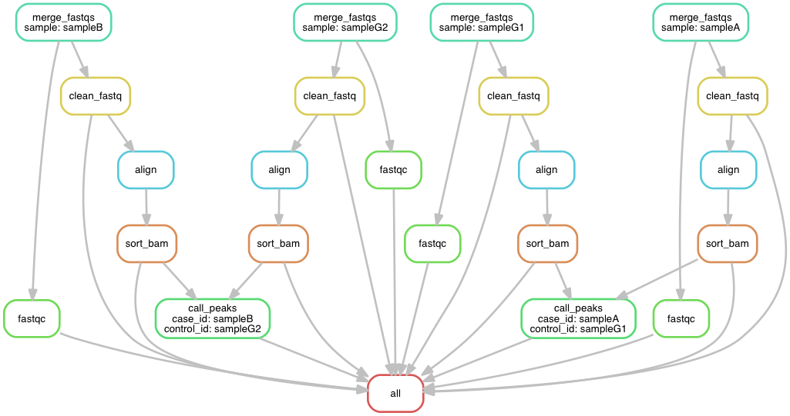

### Why using snakemake
[Snakemake](https://bitbucket.org/snakemake/snakemake/wiki/Home) is a python3 based pipeline building tool (a python variant of GNU [make](https://www.gnu.org/software/make/)) specialized for bioinformatics. I put my notes managing different versions of python [here](https://github.com/crazyhottommy/RNA-seq-analysis/blob/master/use_multiple_version_python.md). You can write any python codes inside the Snakefile. Using snakemake is to simplify the tedious pre-processing work for large genomic data sets and for the sake of reproducibility. There are many other [tools](https://github.com/pditommaso/awesome-pipeline) you can find here for this purpose.

### Key features of snakemake

* Snakemake automatically creates missing directories.

* wildcards and Input function

To access wildcards in a shell command:  `{wildcards.sample}`

`{wildcards}` is greedy `(.+)`:
`{sample}.fastq` could be matching `sampleA.fastq` if there is no sub-folder anymore, but even `whateverfolder/sampleA.fastq` can be matched as well.

One needs to think snakemake in a bottom-up way: snakemake will first look for the output files, and substitue the file names to the `{wildcards}`, and look for which rule can be used to creat the output, and then look for input files that are defined by the `{wildcards}`.

The `wildcards` is pretty confusing to me. read the posts in the google group by [searching wildcards](https://groups.google.com/forum/#!searchin/snakemake/wildcards) 

read threads below:
https://groups.google.com/forum/#!searchin/snakemake/glob_wildcards/snakemake/YfHgx6P5se4/CRk-d151GBwJ  
https://groups.google.com/forum/#!searchin/snakemake/glob_wildcards/snakemake/FsdT4ioRyNY/LCm6Xj8dIAAJ  
https://groups.google.com/forum/#!searchin/snakemake/glob_wildcards/snakemake/JAcOdGgWR_g/1nT9nsNkCgAJ  


[quote](https://groups.google.com/forum/#!searchin/snakemake/glob_wildcards/snakemake/FsdT4ioRyNY/LCm6Xj8dIAAJ) from the snakemake developer:
>The generation of the final target is nearly always the complex part of the workflow. You have to determine, which files exist and somehow tell Snakemake which files you want it to generate. `glob_wildcards` and `expand` helps a lot - it was really painful in the versions before it was implemented, but often you have to write some custom code, if it gets complicated

#### Read the following
[flexible bioinformatics pipelines with snakemake](http://watson.nci.nih.gov/~sdavis/blog/flexible_bioinformatics_pipelines_with_snakemake/)    
[Build bioinformatics pipelines with Snakemake](https://slowkow.com/notes/snakemake-tutorial/)  
[snakemake ChIP-seq pipeline example](https://hpc.nih.gov/apps/snakemake.html)  
[submit all the jobs immediately](https://bitbucket.org/snakemake/snakemake/issues/28/clustering-jobs-with-snakemake)  
[cluster job submission wrappers](https://groups.google.com/forum/#!searchin/snakemake/dependencies/snakemake/1QelazgzilY/oBgZoP19BL4J)  
[snakemake-parallel-bwa](https://github.com/inodb/snakemake-parallel-bwa)  
[RNA-seq snakemake example](http://www.annotathon.org/courses/ABD/practical/snakemake/snake_intro.html)  
[functions as inputs and derived parameters](https://groups.google.com/forum/#!msg/Snakemake/0tLS6KrXA5E/Oe5umTdluq4J)  
[snakemake FAQ](https://bitbucket.org/snakemake/snakemake/wiki/FAQ)  
[snakemake tutorial from the developer](http://snakemake.bitbucket.org/snakemake-tutorial.htm)  

### examples
https://github.com/slowkow/snakefiles/blob/master/bsub.py  
https://github.com/broadinstitute/viral-ngs/tree/master/pipes

### [A working snakemake pipeline for ChIP-seq](https://github.com/crazyhottommy/ChIP-seq-analysis/tree/master/snakemake_ChIPseq_pipeline)

The folder structure is like this:

```
├── README.md
├── Snakemake
├── config.yaml
└── rawfastqs
    ├── sampleA
    │   ├── sampleA_L001.fastq.gz
    │   ├── sampleA_L002.fastq.gz
    │   └── sampleA_L003.fastq.gz
    ├── sampleB
    │   ├── sampleB_L001.fastq.gz
    │   ├── sampleB_L002.fastq.gz
    │   └── sampleB_L003.fastq.gz
    ├── sampleG1
    │   ├── sampleG1_L001.fastq.gz
    │   ├── sampleG1_L002.fastq.gz
    │   └── sampleG1_L003.fastq.gz
    └── sampleG2
        ├── sampleG2_L001.fastq.gz
        ├── sampleG2_L002.fastq.gz
        └── sampleG2_L003.fastq.gz

```

There is a folder named `rawfastqs` containing all the raw fastqs. each sample subfolder contains multiple fastq files from different lanes.

In this example, I have two control (Input) samples and two corresponding case(IP) samples.

```
CONTROLS = ["sampleG1","sampleG2"]
CASES = ["sampleA", "sampleB"]
```
putting them in a list inside the `Snakefile`. If there are many more samples,
need to generate it with `python` programmatically.


```bash
## dry run
snakemake -np

## work flow diagram
snakemake --forceall --dag | dot -Tpng | display

```



###To Do:  

* Make the pipeline more flexiable. e.g. specify the folder name containing raw fastqs, now it is hard coded.
* write a wrapper script for submitting jobs in `moab`. Figuring out dependencies and `--immediate-submit`

`snakemake -k -j 1000 --forceall --cluster-config cluster.json --cluster "msub -V -N '{rule.name}_{wildcards.sample}' -l nodes={cluster.nodes}:ppn={cluster.cpu} -l mem={cluster.mem} -l walltime={cluster.time} -m {cluster.EmailNotice} -M {cluster.email}"`
